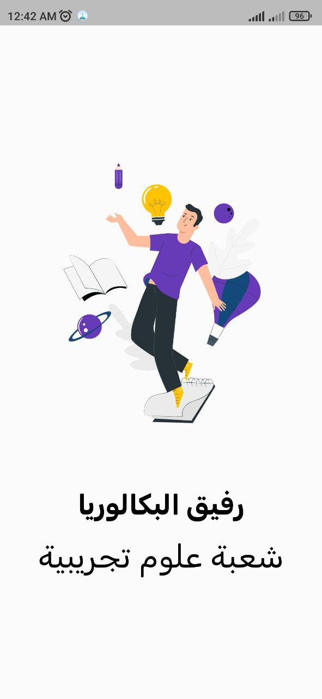
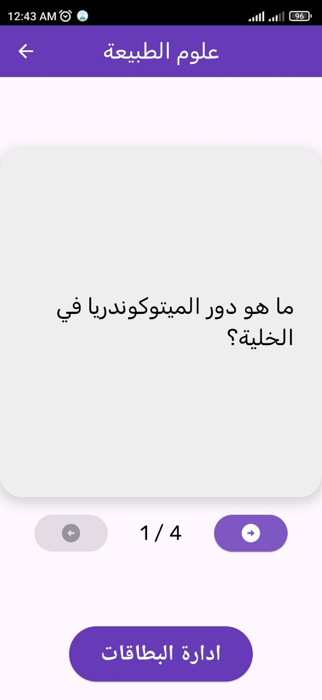
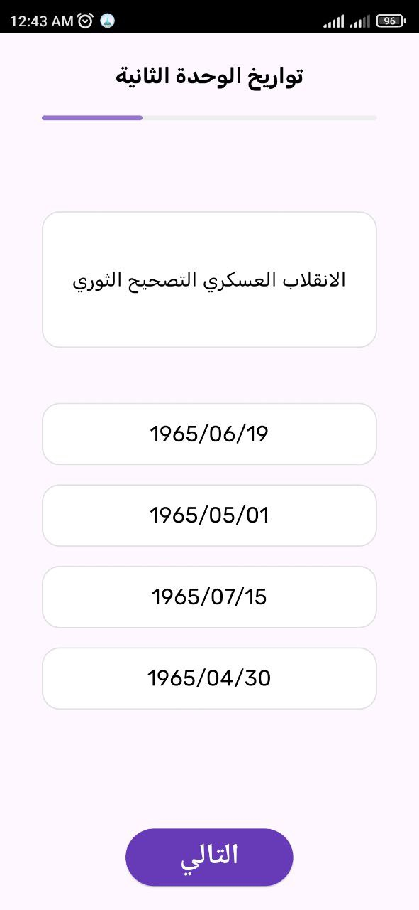
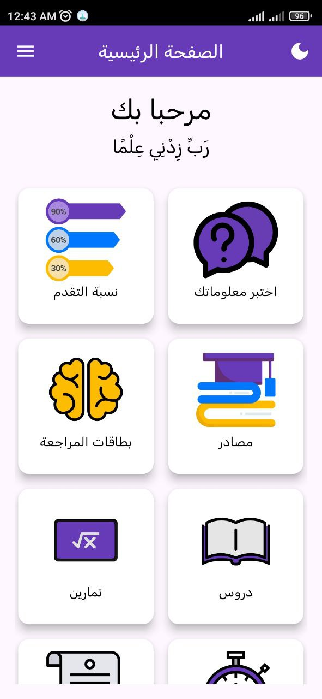

# Bac Companion

Bac Companion is a Flutter-based mobile application designed to help Algerian students prepare for the Baccalaureate exam. It provides quizzes, flashcards, past exam subjects, and educational resources tailored for the Scientific Stream (Sciences Expérimentales).

## Features
- **Quizzes:** Interactive multiple-choice questions for various subjects.
- **Flashcards:** Quick review of key concepts.
- **Past Exams:** Access to previous Baccalaureate subjects.
- **Resources:** Study materials and additional learning support.

## Technologies Used
- Flutter
- Dart
- Firebase
- SQLITE

## Installation
1. Clone the repository:
   ```bash
   git clone https://github.com/mohammed-el-amine-kichah/bac-helper-science.git
   ```
2. Navigate to the project folder:
   ```bash
   cd bac-helper-science
   ```
3. Install dependencies:
   ```bash
   flutter pub get
   ```
4. Run the app:
   ```bash
   flutter run
   ```

## Screenshots
<p align="center">
  
  
  
  
</p>


## License
This project is open-source and available under the MIT License.
